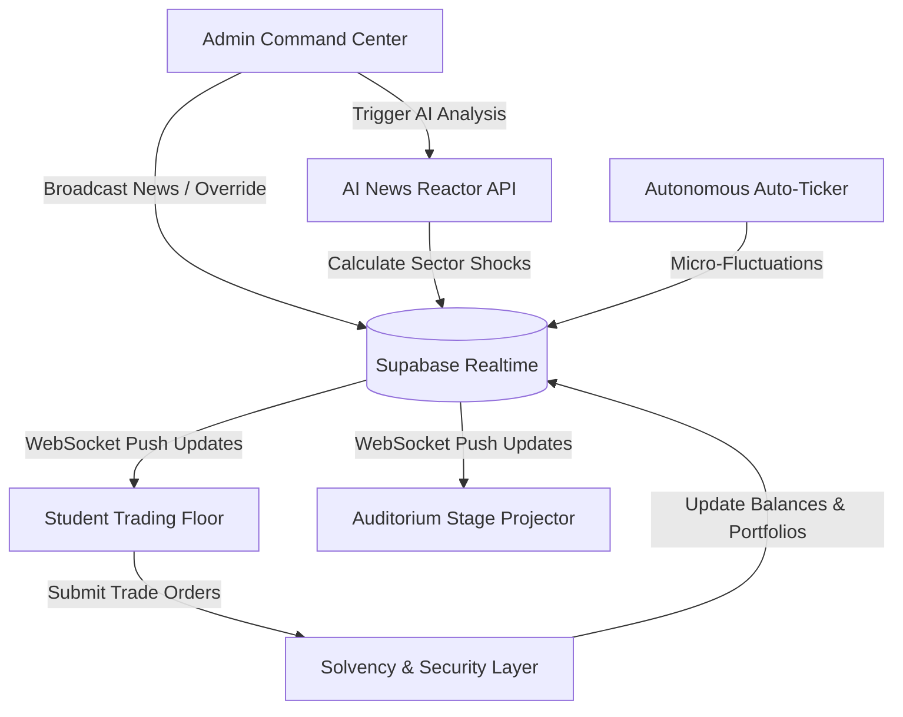

<div align="center">

# ⚡ INVESTOR FORUM
### *Next-Generation Real-Time Financial Arena & Auditorium Projector*

[](https://nextjs.org/)
[](https://supabase.com/)
[](https://ai.google.dev/)
[](https://tailwindcss.com/)
[](https://vercel.com/)
[](LICENSE)

<br />

```
========================================================================================
   [ 🏛️ AUDITORIUM PROJECTOR ]  ◄──►  [ ⚡ SUPABASE REALTIME ]  ◄──►  [ 📈 TRADING FLOOR ]
                                             ▲
                                             │
                           [ 🤖 AI NEWS SHOCK ENGINE ]
                                             ▲
                                             │
                              [ 🛡️ ADMIN COMMAND DESK ]
========================================================================================
```

<p align="center">
  <b>A high-frequency financial trading simulation, stage projector, and autonomous market shock engine designed for collegiate competitions and investment summits.</b>
</p>

[Explore Screens](#-screen-showcase) •
[Quickstart](#-quickstart-guide) •
[Architecture](#-system-architecture) •
[Vercel Deployment](#-one-click-deploy-to-vercel) •
[Security](#-security--anti-cheat-controls)

---

</div>

<br />

## 🌟 Highlights & Key Capabilities

<table>
<tr>
<td width="50%" valign="top">

### 🏛️ Auditorium Stage Projector (`/projector`)
* Designed for 4K / 1080p stadium and auditorium stage displays.
* **Auto-cycling display modes** with live podium countdown timers.
* **Dynamic Marquee Ticker Tape** showcasing real-time market movers and volume.
* **Live Breaking News Flash Bar** with instant animated macroeconomic warnings.
* **Zero-flicker** SVG sparkline rendering for all tracked equities.

</td>
<td width="50%" valign="top">

### 📈 Student Trading Floor (`/`)
* **Sub-millisecond trade execution** with instant portfolio calculation.
* Interactive multi-timeframe sparklines with SVG gradient isolation.
* Buy/Sell modal with live solvency checks, slippage preview, and cash buffer validation.
* **Comprehensive Market Intelligence tab** with sector distribution & heatmaps.
* **Team Data Room & Vault** with downloadable financial briefing packs.

</td>
</tr>
<tr>
<td width="50%" valign="top">

### 🛡️ Admin Command Center (`/admin`)
* **Real-time Stock Controls**: Add custom stocks, adjust pricing, or permanently delete equities.
* **Circuit Breakers & Halts**: Instant freeze of market transactions during emergencies.
* **Team Governance**: Adjust cash allocations, disqualify teams, or ban malicious participants.
* **Breaking News Broadcast**: Publish macroeconomic events and trigger AI reactions.

</td>
<td width="50%" valign="top">

### 🤖 AI News Reactor (`/api/ai/news-impact`)
* Powered by advanced **AI Reasoning Engines** for institutional macroeconomic shocks.
* Automatically assesses headline sentiment, sector exposure, and volatility multipliers.
* Generates realistic price shocks with historical candle progression.
* Algorithmic failover shock generator guarantees 100% uptime even during network timeouts.

</td>
</tr>
</table>

---

## 🏗️ System Architecture



---

## 🎨 Bespoke Executive Palette (Light & Dark)

Built with an executive color palette (`#1B0805` Espresso, `#402B28` Mahogany, `#EAE0D3` Sand, `#F8F4ED` Linen, `#303D37` Forest Slate), eliminating harsh glare and maximizing readability in brightly lit auditoriums and dark trading desks alike.

```
┌──────────────────────────────┬──────────────────────────────┐
│       ☀️ Warm Linen Light    │       🌙 Espresso Black Dark │
├──────────────────────────────┼──────────────────────────────┤
│  Canvas:       #F8F4ED       │  Canvas:       #1B0805       │
│  Surfaces:     #FFFFFF       │  Surfaces:     #25120E       │
│  Borders:      #E4DDD3       │  Borders:      #3D241E       │
│  Primary CTA:  #402B28       │  Primary CTA:  #EAE0D3       │
│  Text Primary: #1B0805       │  Text Primary: #F8F4ED       │
│  Positive:     #059669       │  Positive:     #00D68F       │
│  Negative:     #E11D48       │  Negative:     #FF5B4F       │
└──────────────────────────────┴──────────────────────────────┘
```

---

## 🚀 One-Click Deploy to Vercel

Deploy the complete platform with serverless edge API functions in under 2 minutes:

[](https://vercel.com/new/clone?repository-url=https%3A%2F%2Fgithub.com%2FACE-Society-IT%2Finvestor-forum)

### Required Environment Variables

Configure these in your Vercel Project Settings (`Settings -> Environment Variables`):

| Variable | Description | Required | Example |
|---|---|:---:|---|
| `NEXT_PUBLIC_SUPABASE_URL` | Your Supabase Project API URL | **Yes** | `https://xyzcompany.supabase.co` |
| `NEXT_PUBLIC_SUPABASE_ANON_KEY` | Supabase public anonymous API key | **Yes** | `eyJhbGciOi...` |
| `GOOGLE_API_KEY` | Google Gemini AI API Key | **Yes** | `AIzaSy...` |
| `NEXT_PUBLIC_GOOGLE_API_KEY` | Public Google Gemini API Key | **Yes** | `AIzaSy...` |
| `AI_MODEL_NAME` | Model identifier for AI news analysis | **No** | `gemma-4-26b-a4b-it` |

---

## 💻 Quickstart Guide

### 1. Clone the Repository
```bash
git clone https://github.com/ACE-Society-IT/investor-forum.git
cd investor-forum
```

### 2. Install Dependencies
```bash
npm install
```

### 3. Setup Environment Variables
```bash
cp .env.example .env.local
```
Edit `.env.local` with your Supabase credentials and Google Gemini API key.

### 4. Run Development Server
```bash
npm run dev
```
Visit:
- **Trading Floor:** [http://localhost:3000](http://localhost:3000)
- **Auditorium Projector:** [http://localhost:3000/projector](http://localhost:3000/projector)
- **Admin Command Center:** [http://localhost:3000/admin](http://localhost:3000/admin) *(Default pass: `admin123`)*

---

## 🗄️ Database Setup & Migrations

Run the SQL migration scripts in order within your Supabase SQL Editor:

1. [`supabase/migrations/202609070001_initial_schema.sql`](supabase/migrations/202609070001_initial_schema.sql) - Base tables (`stocks`, `teams`, `portfolio`, `transactions`, `news_events`).
2. [`supabase/migrations/202609070002_investor_forum_competition.sql`](supabase/migrations/202609070002_investor_forum_competition.sql) - Competition state, circuit breaker columns, and Realtime replication flags.

---

## 🔐 Security & Anti-Cheat Controls

- **🛡️ Trade Solvency Verification**: Validates cash balances, owned share counts, positive whole-integer quantities, and hard trade limits prior to database commits.
- **🚫 Anti-Brute-Force Rate Limiting**: Admin login features exponential backoff, locking out repeated credential guessing after 5 failed attempts.
- **🧹 Input Sanitization**: Strips HTML tags, script vectors, and invalid characters from ticker symbols, company names, and news bulletins.
- **🔑 Zero Secret Leaks**: Strict separation of client environment variables and server-side secret credentials.

---

## 📜 Available Scripts

| Command | Description |
|---|---|
| `npm run dev` | Starts local development server on `http://localhost:3000` |
| `npm run build` | Compiles optimized Next.js production bundle with Turbopack |
| `npm run start` | Runs the production server |
| `npm run lint` | Runs ESLint check across all code files |

---

## 👥 Built with ACE Society

Built for high-energy investment tournaments, collegiate finance challenges, and hackathon trading floors.

<div align="center">
  <sub>Released under the <a href="LICENSE">MIT License</a>. Made with ❤️ by ACE Society.</sub>
</div>
