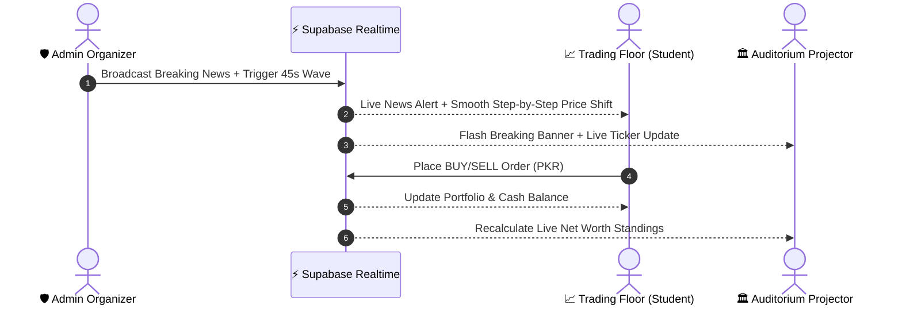

<div align="center">

# 📈 INVESTOR FORUM

### *Real-Time Stock Trading Simulation & Auditorium Stage Engine*

<p align="center">
  <a href="https://github.com/ACE-Society-IT/investor-forum">
    
  </a>
</p>

<p align="center">
  
  
  
  
  
</p>

<br />

```
========================================================================================
   [ 🏛️ AUDITORIUM PROJECTOR ]  ◄──►  [ ⚡ SUPABASE REALTIME ]  ◄──►  [ 📈 TRADING FLOOR ]
                                              ▲
                                              │
                            [ 📰 45s PRICE WAVE ENGINE ]
                                              ▲
                                              │
                               [ 🛡️ ADMIN COMMAND DESK ]
========================================================================================
```

<p align="center">
  <b>A live stock trading arena built for university summits, finance challenges, and collegiate competitions.</b>
</p>

[🎮 Trading Floor](#-the-experience) •
[✨ Features](#-key-features) •
[🚀 Quick Start](#-quick-start) •
[🧭 Screen Directory](#-all-screens--routes) •
[🛡️ Admin Controls](#-organizer--admin-guide)

---

</div>

<br />

## 🎮 The Experience

<table align="center" width="100%">
<tr>
<td width="33%" align="center" valign="top">

### 📈 1. Trade
**For Participants**  
Sub-second buy and sell order execution. Manage your cash balance in **PKR**, build a diversified portfolio, and react fast to breaking headlines.

</td>
<td width="33%" align="center" valign="top">

### 📰 2. React
**45-Second Price Waves**  
Breaking news hits the floor without sector spoilers. Participants analyze the story while prices smoothly shift over a live 45-second wave.

</td>
<td width="33%" align="center" valign="top">

### 🏆 3. Win
**Stage Projector View**  
Auditorium screens update automatically via WebSockets, celebrating top podium finishers with gold, silver, and bronze trophies.

</td>
</tr>
</table>

---

## ✨ Key Features

```
⚡ Real-Time Trading    ──► Instant order execution with zero page refresh
💰 Pakistani Rupee (PKR)──► All stock prices, orders, and balances in PKR
📰 45s Shock Waves      ──► Realistic gradual price transitions after news
📊 Dynamic Sparklines   ──► High-performance SVG trend charts for all 10 stocks
📱 Any Device Access    ──► Seamlessly trade on phones, laptops, and tablets
🖥️ Stage Projector Mode ──► Fullscreen auditorium display with podium medals
🔒 Single-Desk Lock     ──► Prevents account sharing and unauthorized logins
```

---

## 🔄 Live System Architecture


```mermaid
sequenceDiagram
    autonumber
    actor Admin as 🛡️ Admin Organizer
    participant Server as ⚡ Supabase Realtime
    actor Student as 📈 Trading Floor (Student)
    actor Stage as 🏛️ Auditorium Projector

    Admin->>Server: Broadcast Breaking News + Trigger 45s Wave
    Server-->>Student: Live News Alert + Smooth Step-by-Step Price Shift
    Server-->>Stage: Flash Breaking Banner + Live Ticker Update
    Student->>Server: Place BUY/SELL Order (PKR)
    Server-->>Student: Update Portfolio & Cash Balance
    Server-->>Stage: Recalculate Live Net Worth Standings
```

---

## 🚀 Quick Start

<details open>
<summary><b>💻 Run Locally in 4 Simple Steps (Click to toggle)</b></summary>
<br />

### 1. Clone the repository
```bash
git clone https://github.com/ACE-Society-IT/investor-forum.git
cd investor-forum
```

### 2. Install dependencies
```bash
npm install
```

### 3. Create your environment file
Create `.env.local` in the project root:
```env
NEXT_PUBLIC_SUPABASE_URL=your_supabase_project_url
NEXT_PUBLIC_SUPABASE_ANON_KEY=your_supabase_anon_key
GOOGLE_API_KEY=your_gemini_api_key
NEXT_PUBLIC_GOOGLE_API_KEY=your_gemini_api_key
```

### 4. Start the engine
```bash
npm run dev
```
Open **[http://localhost:3000](http://localhost:3000)** in your browser!

</details>

---

## 🧭 All Screens & Routes

<details>
<summary><b>🔍 Explore All Application Pages (Click to expand)</b></summary>
<br />

| Route | Name | Audience | Purpose |
|---|---|---|---|
| `/` | **Landing Page** | Everyone | Tournament overview, rules, and live marquee |
| `/dashboard` | **Trading Floor** | Participants | Login, live stock list, order execution modal, portfolio |
| `/projector` | **Auditorium Screen** | Audience / Stage | Fullscreen leaderboard, podium standings, marquee ticker |
| `/admin` | **Command Center** | Organizers | Staged news drafts, price wave slider, team controls |
| `/leaderboard`| **Tournament Standings**| Public / Teams | Audited net worth standings and performance gains |
| `/news` | **News Wire** | Public / Teams | Complete history of all released market news catalysts |
| `/stocks` | **Market Intel** | Public / Teams | Live price directory with SVG trend sparklines |
| `/rules` | **Rulebook** | Public / Teams | Official tournament handbook and mechanics |

</details>

---

## 🛡️ Organizer & Admin Guide

<details>
<summary><b>👑 How to Run a Live Competition Round (Click to expand)</b></summary>
<br />

1. **Sign In**: Go to `/admin` and enter your master key or admin password.
2. **Pre-Staged News Drafts**:
   - Open the **News Manager** tab to access the pre-configured Day 1 & Day 2 news events.
   - Choose between **"Release & 45s Wave"** (gradual realistic market movement) or **"Story Only"** (announcement without price shock).
3. **Market Circuit Breakers**:
   - Pause or unpause the entire floor instantly during announcements or round transitions.
4. **Team Session Management**:
   - View locked IP addresses and devices for each desk.
   - Unlock a desk with one click if a team needs to switch to a backup laptop.

</details>

---

## 🛠️ Technology Stack

<div align="center">

| Core Framework | Database & WebSockets | Styling & Motion | Icons | Deployment |
|:---:|:---:|:---:|:---:|:---:|
| **Next.js 16** | **Supabase** | **Tailwind CSS** | **Lucide Icons** | **Vercel** |

</div>

---

## 📜 Available Commands

```bash
npm run dev     # 🚀 Start local development server (localhost:3000)
npm run build   # 📦 Build optimized production bundle
npm run start   # ⚡ Run production server
npm run lint    # 🔍 Check codebase for errors
```

---

<div align="center">

### 👥 Built with ACE Society
*Designed for collegiate finance competitions, trading summits, and hackathons.*

<sub>Released under the **MIT License**. Made with ❤️ by ACE Society.</sub>

</div>
